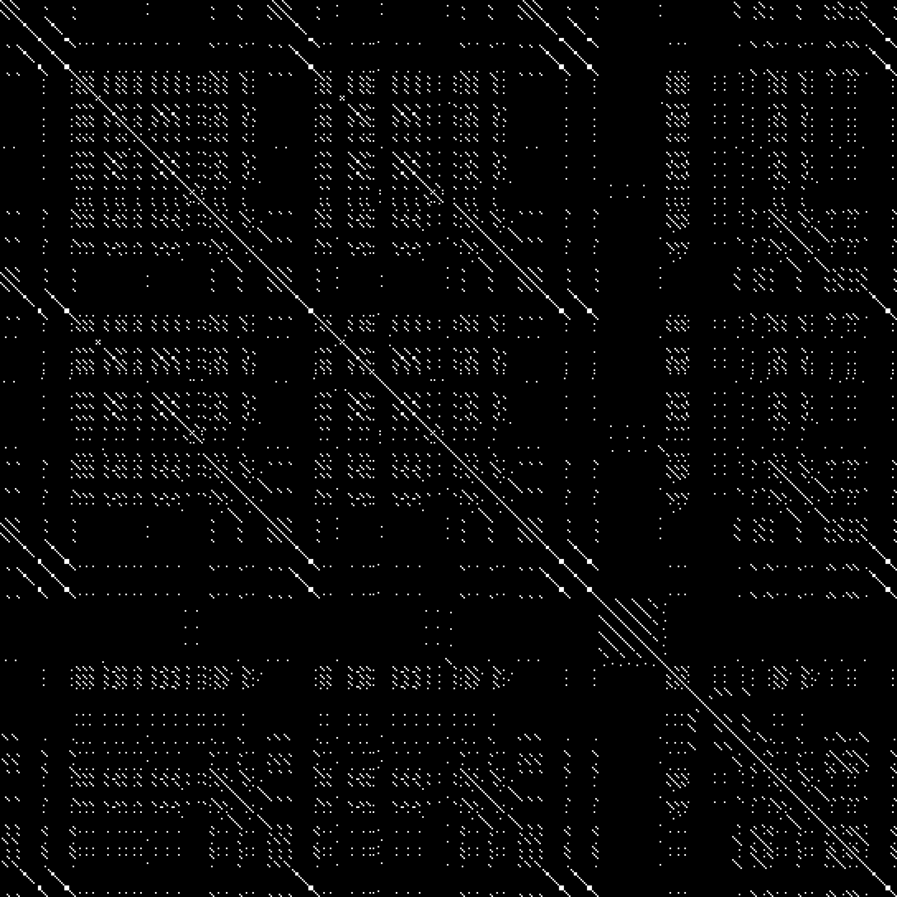
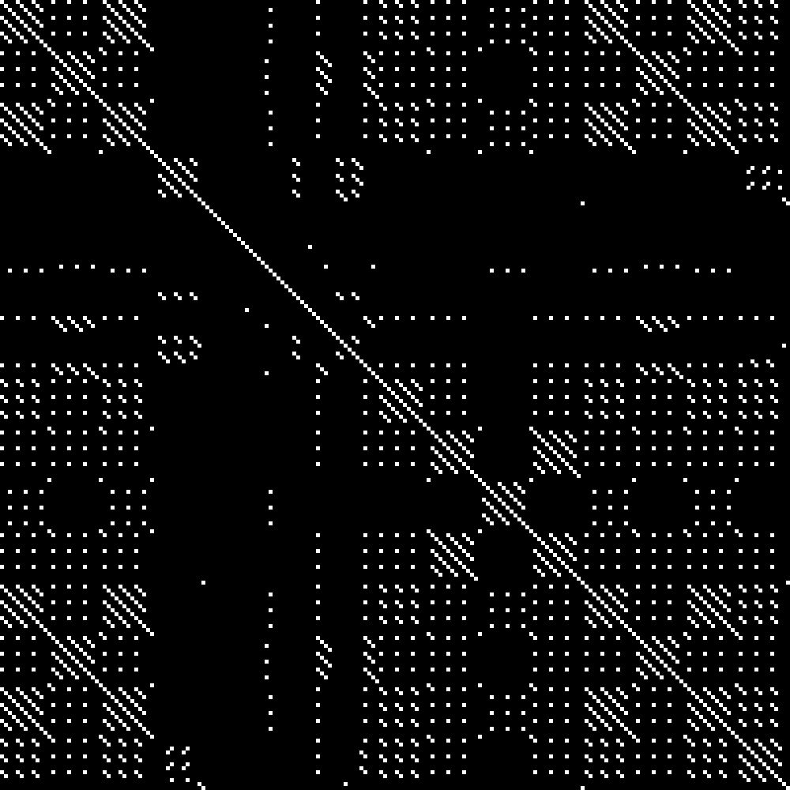
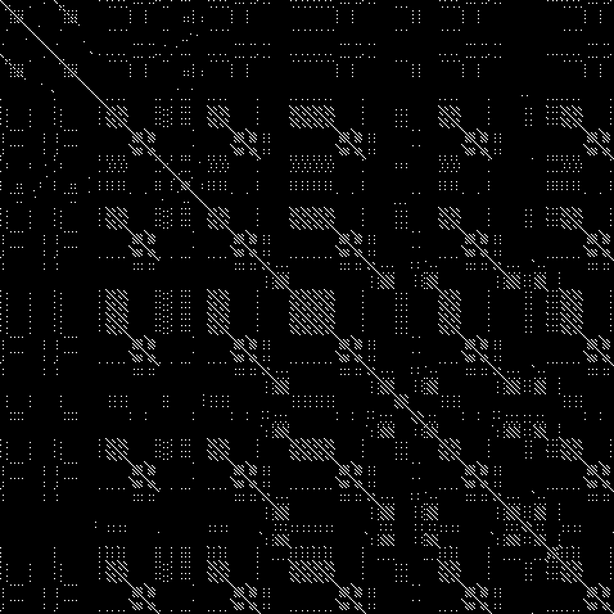

# SongRepeat
## Python script showing repetition in text (and songs)

### Inspired by https://github.com/colinmorris/SongSim

# Examples :

## - Lady Gaga - Bad Romance


## - Foals - White Onions


## - Foals - What Went Down



# How to use :

## Requirements :
- Python3
- Python3 modules (install with pip3):
  - **numpy**
  - **PIL**

## Launch the script :

Give a file to the script, it will show you an image:
```
./songrepeat.py lyrics/bad_romance
```
You can also directly save an image in a png format:
```
./songrepeat.py lyrics/bad_romance -s
```

# Made by Henrixounez